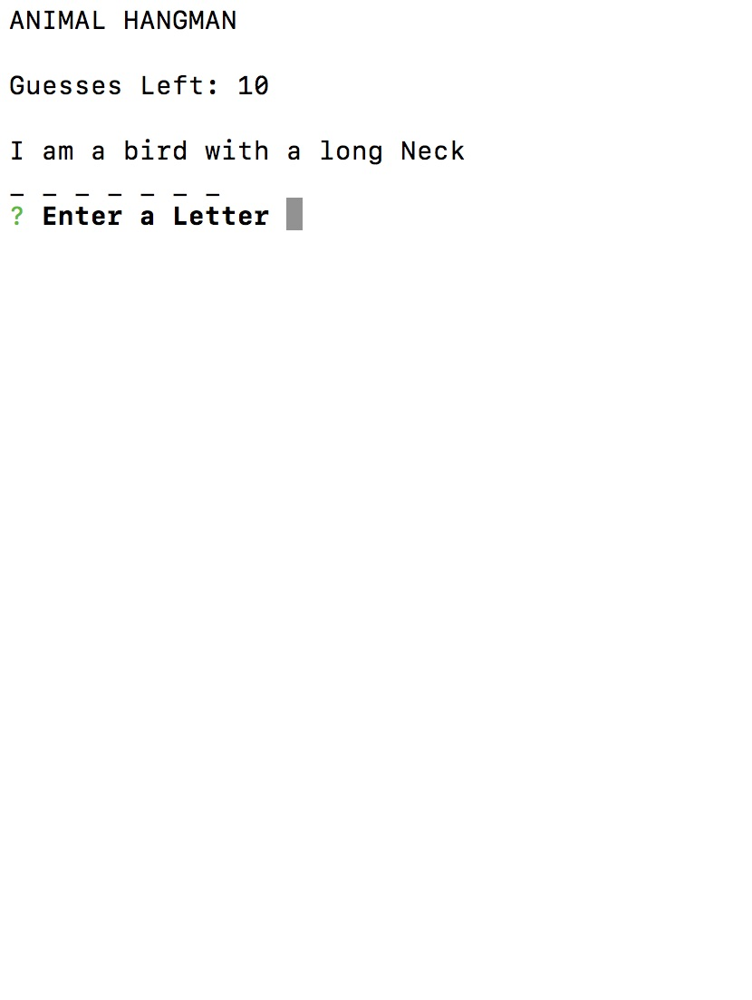
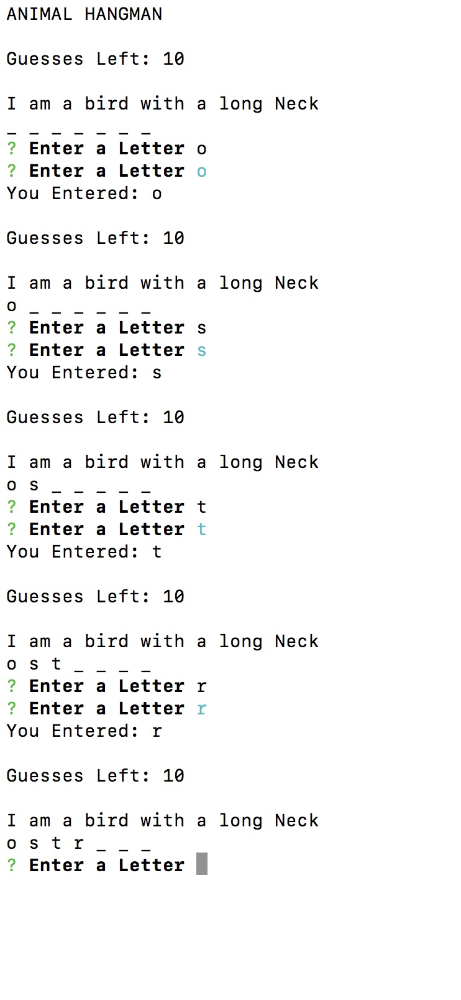
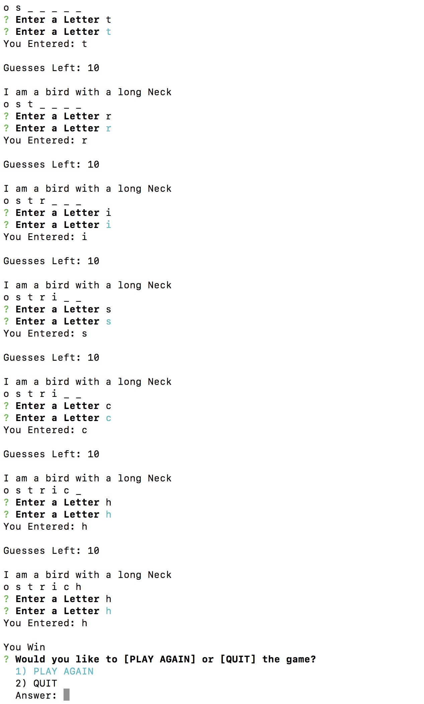

# CLI-HANGMAN
A Hangman Game played from the command line using Node.js

This is a command line version of the Hangman using constructors.  Deployed in Heroku. 

[Website](https://cli-hangman.herokuapp.com/)

